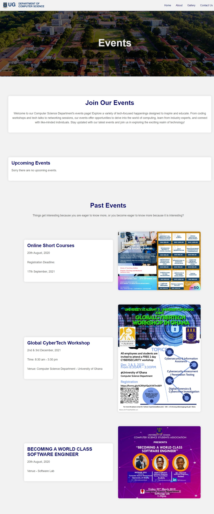
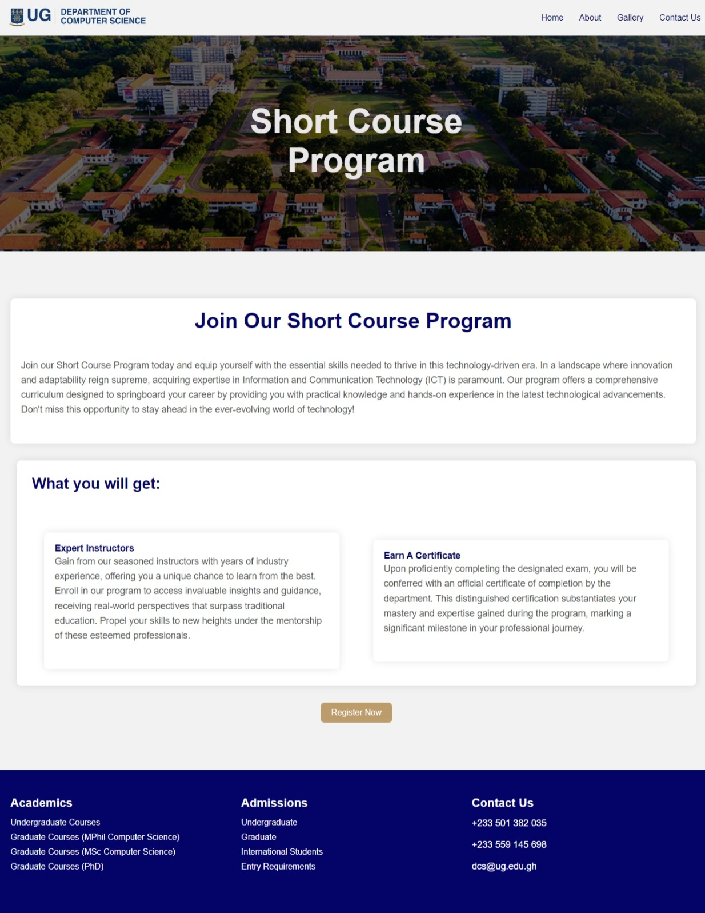

# Computer Science Department Website

Introduction and Purpose
- This project entails the creation of a 10-page website dedicated to the Computer Science Department. The objective is to enhance user experience, accessibility, and information presentation related to various facets of the department.

How to Clone and Set Up the Project
To clone and set up the project, follow these steps:
1. Clone the repository from https://github.com/AkweiBrown/11357610_DCIT205.git.
2. Navigate to the project directory.
3. Open the index.html file in your preferred web browser to explore the website.

Author Information
- Author: Ryan Brown
- Student ID: 11357610
  
---

### Below are screenshots of each page of the website:

Home Page

About Page

Contact Page

Events Page

MPhil / BSC Programme Page

Short Courses Page

Undergraduate Programmes Page

Phd Programmes Page

Register Page

Gallery Page

---

### Lessons Learned

Throughout the development of this project, I gained valuable insights and honed my skills in various aspects of web development:

1. **Deepened Understanding of Front-End Technologies:** This project provided me with a solid foundation in HTML, CSS, and JavaScript/React, empowering me to craft robust and interactive web interfaces.

2. **Responsive Design Expertise:** I successfully implemented responsive design techniques, ensuring that the website seamlessly adapts to different screen sizes, devices, and orientations. This resulted in enhanced user experience across all platforms.

3. **Effective Information Architecture:** I developed a well-structured information architecture for the website, prioritizing user-friendliness and intuitive navigation. This led to a significant improvement in user engagement, demonstrating the effectiveness of clear and organized information presentation.

4. **Time Management and Priority Setting:** While juggling multiple tasks and meeting deadlines, I learned the importance of effective time management and priority setting. This allowed me to overcome challenges and deliver the project on schedule and within budget.

5. **User Accessibility Enhancements:** In response to user feedback, I made significant improvements to enhance accessibility, including making the site responsive and incorporating a gallery page with aesthetically appealing elements to promote better user engagement.

Overall, the creation of this demo website reinforced the importance of hands-on learning, practical application of theoretical concepts, and continuous improvement. It highlighted the power of responsive design, effective information architecture, and thoughtful user accessibility considerations in creating a successful and engaging web experience.

Thank you.