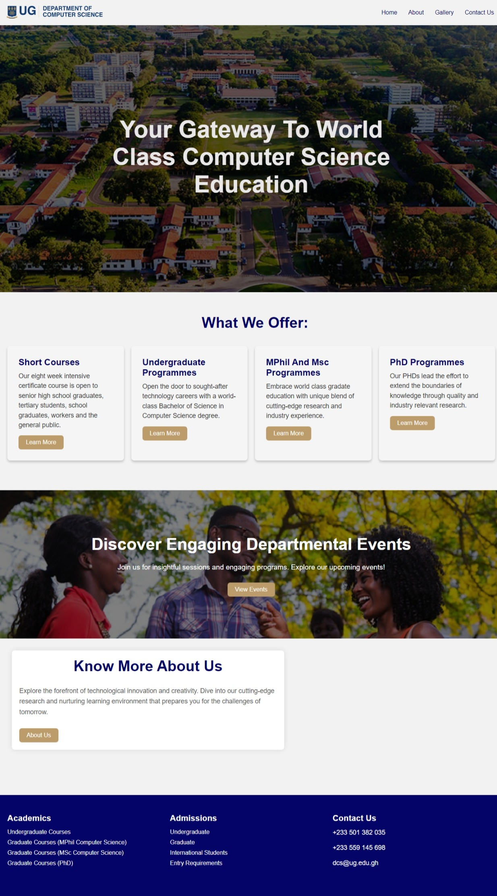
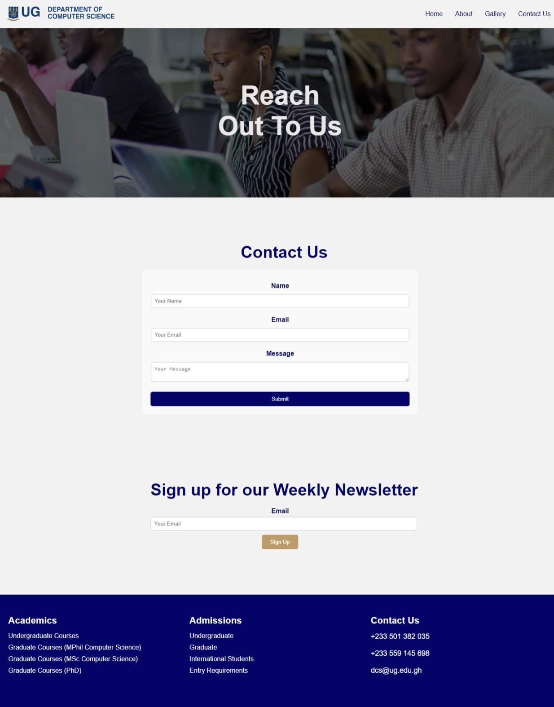
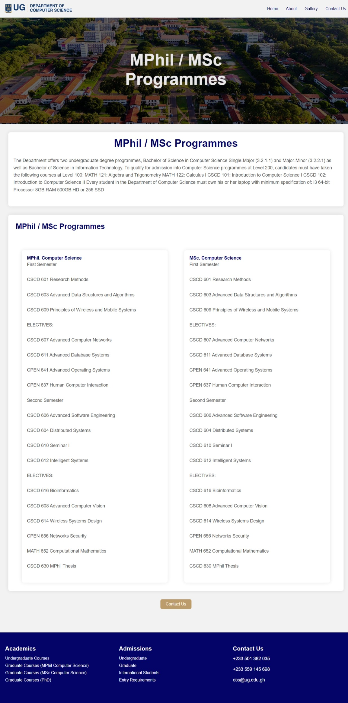
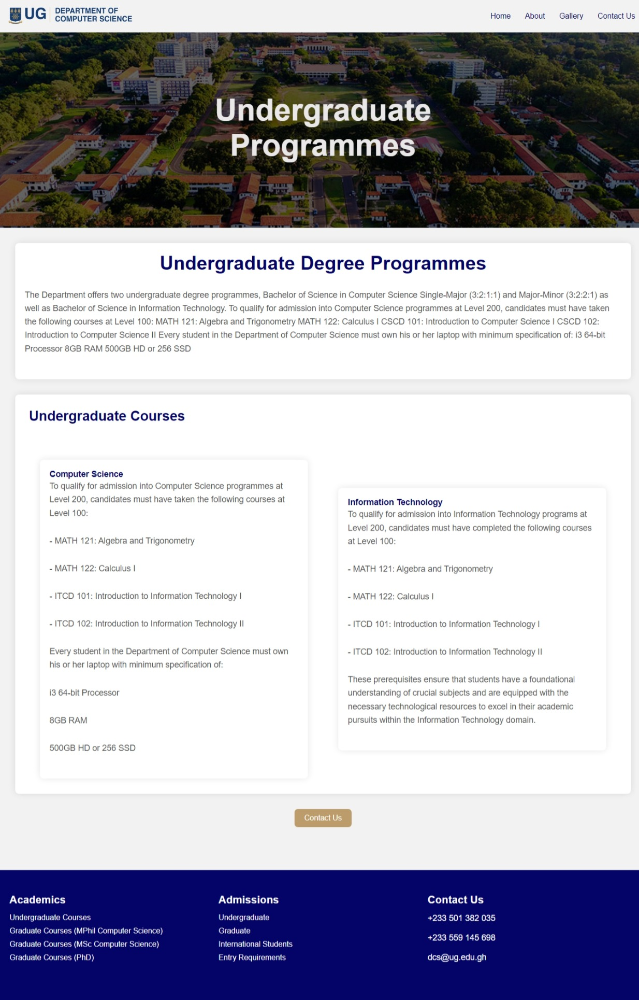
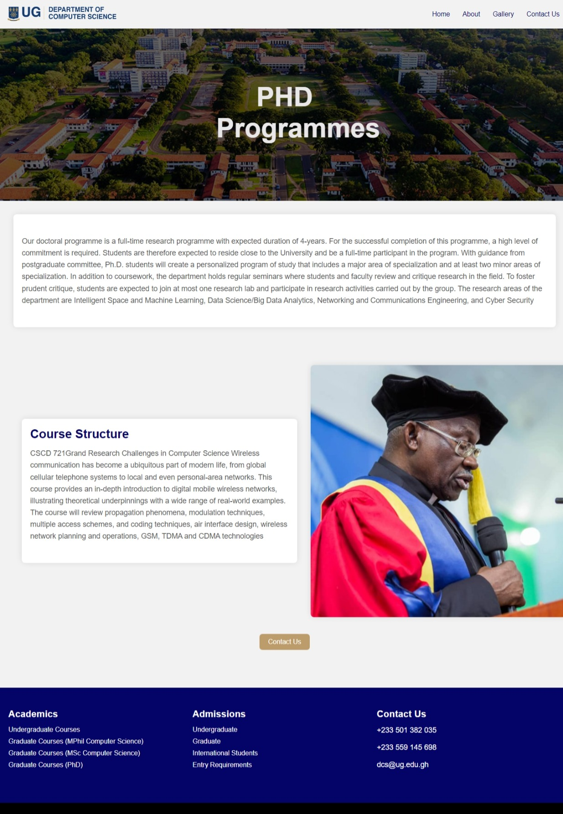
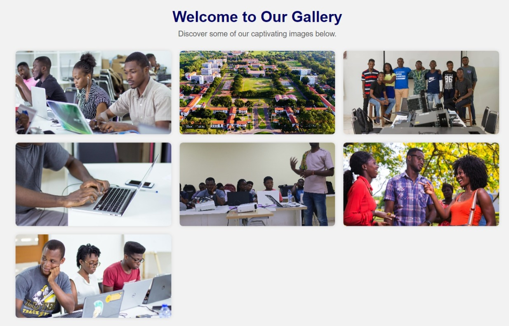

Computer Science Department Website

Introduction and Purpose
This project entails the creation of a 10-page website dedicated to the Computer Science Department. The objective is to enhance user experience, accessibility, and information presentation related to various facets of the department.

How to Clone and Set Up the Project
To clone and set up the project, follow these steps:
1. Clone the repository from https://github.com/AkweiBrown/11357610_DCIT205.git.
2. Navigate to the project directory.
3. Open the index.html file in your preferred web browser to explore the website.

Author Information
Author: Ryan Brown
Student ID: [11357610]
Screenshots

Below are screenshots of each page of the website:

Home Page

About Page

Contact Page

Events Page

MPhil / BSC Programme Page

Short Courses Page

Undergraduate Programmes Page

Phd Programmes Page

Register Page

Gallery Page

Lessons Learned
Throughout the development of this project, several key learnings were acquired:

Enhanced understanding of HTML, CSS, and JavaScript/React for frontend web development.
Improved skills in implementing responsive design for various devices.
Acquired proficiency in organizing and presenting information effectively on web platforms.
Conclusion
The creation of the Computer Science Department website offered valuable insights into frontend development techniques while emphasizing user-centered design and accessibility.

