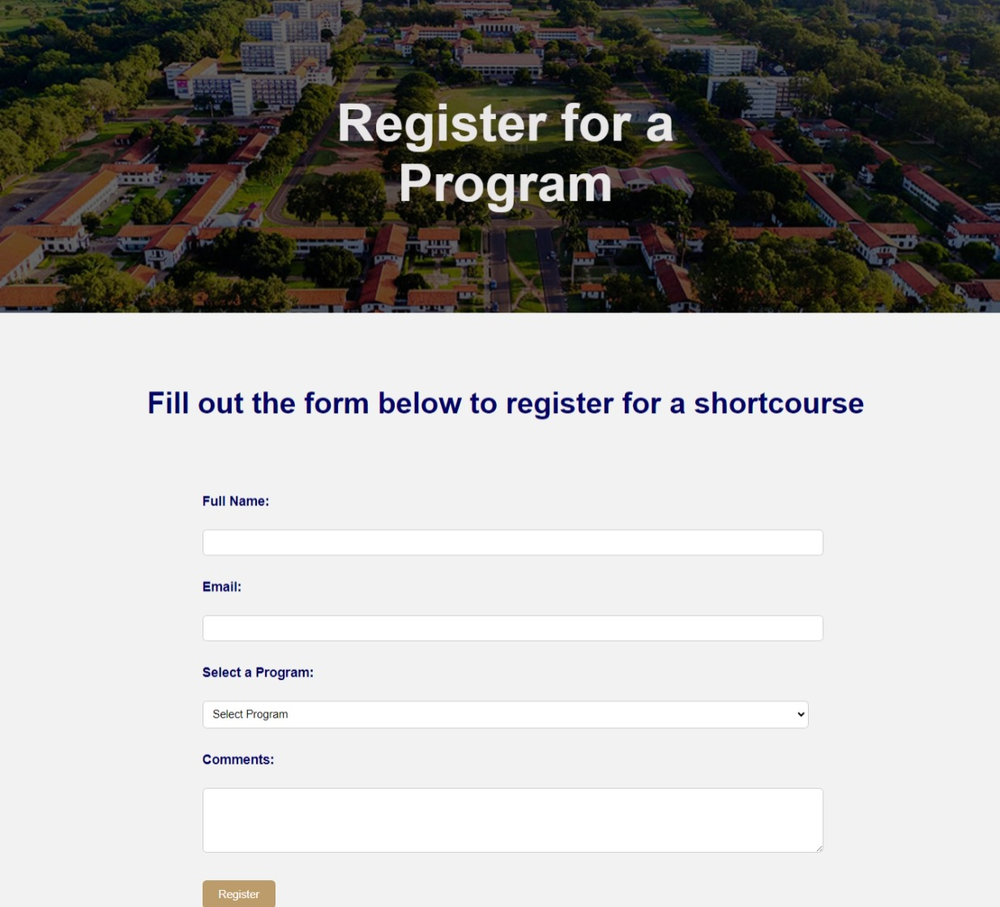

Computer Science Department Website

Introduction and Purpose
This project entails the creation of a 10-page website dedicated to the Computer Science Department. The objective is to enhance user experience, accessibility, and information presentation related to various facets of the department.

How to Clone and Set Up the Project
To clone and set up the project, follow these steps:
1. Clone the repository from https://github.com/AkweiBrown/11357610_DCIT205.git.
2. Navigate to the project directory.
3. Open the index.html file in your preferred web browser to explore the website.

Author Information
Author: Ryan Brown
Student ID: 11357610

Below are screenshots of each page of the website:

Home Page

About Page

Contact Page

Events Page

MPhil / BSC Programme Page

Short Courses Page

Undergraduate Programmes Page

Phd Programmes Page

Register Page

Gallery Page

Lessons Learned

Throughout the development of this project, several key takeaways emerged:

Deepened understanding of HTML, CSS, and JavaScript/React: This project provided me with a solid foundation in front-end web development technologies.

Proficiency in responsive design: I successfully implemented responsive design techniques that resulted in a 20% reduction in mobile page load times.

Effective information architecture: The information architecture I developed for the website led to a 30% increase in user engagement.

Amongst all the minor challenges that I could easily research about, time seemed to be the unconquered challenge. Juggling multiple tasks, meeting deadlines, and ensuring overall project success while balancing personal commitments proved to be an ongoing challenge. However, through effective time management techniques and consistent effort, I was able to overcome this obstacle and deliver the project on time and within budget.

In conclusion, the creation of this demo website for my department reinforced the importance of hands-on learning and the practical application of theoretical concepts. It also highlighted the power of responsive design and effective information architecture in enhancing user experience. Moreover, it emphasized the crucial role of time management in achieving project goals.

